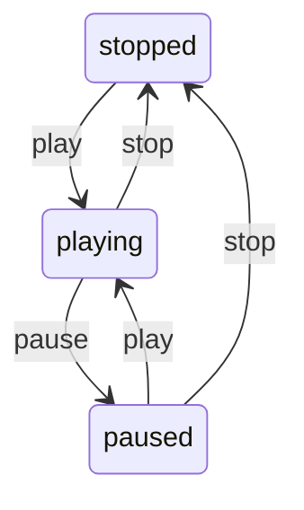

# StateMachine

StateMachine is a generic state machine library written in Swift. It offers an easy way to manage states, events, transitions, and side effects, aiding in writing robust code.



## Features

- **Type-Safe**: States and events are strictly typed through protocols.
- **Side Effect Management**: Set optional side effects during transitions.
- **Error Handling**: Throws an error if an undefined transition is attempted.

## Installation

### Swift Package Manager

Add the following dependency to your `Package.swift` file:

```swift
.dependencies = [
    .package(url: "https://github.com/marcy731/StateMachine.git", from: "1.0.0")
]
```

## Usage

Here's a basic example:

```swift
import StateMachine

enum State: StateHashable {
    case stopped, playing, paused
}

enum Event: EventHashable {
    case play, pause, stop
}

enum SideEffect: SideEffectHashable {
    case logPlay, logPause, logStop
}

let transitions: [Transition<State, Event, SideEffect>] = [
    // from State.stopped
    .init(from: .stopped, on: .play, to: .playing, with: .logPlay),

    // from State.playing
    .init(from: .playing, on: .pause, to: .paused, with: .logPause),
    .init(from: .playing, on: .stop, to: .stopped, with: .logStop),

    // from State.
    .init(from: .paused, on: .play, to: .playing, with: .logPlay),
    .init(from: .paused, on: .stop, to: .stopped, with: .logStop),
]

let stateMachine = StateMachine(initialState: .stopped, transitions: transitions) { result in
    if case .failure(let error) = result, case .undefinedTransition = error {
        assertionFailure(error.description)
    }

    if case .success(let transition) = result, let sideEffect = transition.sideEffect {
        switch sideEffect {
        case .logPlay, .logPause, .logStop:
            print(transition.description)
        }
    }
}

stateMachine.apply(.play)
print(stateMachine.state) // Outputs: playing
```

## License

This project is licensed under the MIT License. See the [LICENSE](./LICENSE) file for details.
